# Agent Orchestration and Workflow in Student Support

### Table of Contents

1. [Overview](#1-overview)
2. [RAG Ingestion Pipeline](#2-rag-ingestion-pipeline)
3. [Runtime RAG Flow](#3-runtime-rag-flow)
4. [API Layer](#4-api-layer)
   - [4.1 Public Support](#411-public-support)
   - [4.2 Authenticated Student Support](#412-authenticated-student-support)
5. [Agent Orchestration](#5-agent-orchestration)
6. [Specialist Agents](#6-specialist-agents)
   - [6.1 Application Agent](#61-application-agent)
   - [6.2 Document Agent](#62-document-agent)
   - [6.3 Offer Agent](#63-offer-agent)
   - [6.4 Loan Agent](#64-loan-agent)
7. [Agent-to-Agent Handoff](#7-agent-to-agent-handoff)
8. [Specialist Agents Using Database Query Tools](#8-specialist-agents-using-database-query-tools)
   - [8.1 Application Query Tools](#81-application-query-tools)
   - [8.2 Document Query Tools](#82-document-query-tools)
   - [8.3 Offer Query Tools](#83-offer-query-tools)
   - [8.4 Loan Query Tools](#84-loan-query-tools)
9. [Application-Scoped Data Access](#9-application-scoped-data-access)
10. [Separation of Policy Data and Application Data](#10-separation-of-policy-data-and-application-data)
11. [Streaming Workflow](#11-streaming-workflow)
    - [11.1 Token Events](#111-token-events)
    - [11.2 Agent Switch Events](#112-agent-switch-events)
    - [11.3 Tool Call Events](#113-tool-call-events)
    - [11.4 Tool Result Events](#114-tool-result-events)
    - [11.5 Completion Event](#115-completion-event)
12. [Public Counsellor Workflow](#12-public-counsellor-workflow)
13. [Workflow Design Principles](#13-workflow-design-principles)

## 1. Overview

The Student Support module provides an AI-powered helpdesk for answering admission-related questions. It combines **multi-agent orchestration**, **policy-based RAG**, and **server-side database query tools** to provide contextual and grounded responses.
The Student Support system is organized into several distinct layers, with each layer responsible for a specific part of the request-processing workflow.

The architecture separates **API handling**, **agent orchestration**, **policy retrieval**, **student-specific data access**, **business logic**, and **persistence**. This separation allows the AI agents to interact with application data without directly accessing the database or implementing business logic themselves.

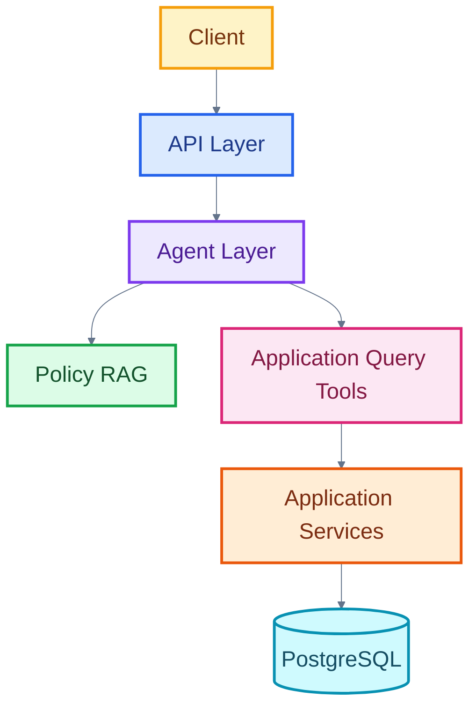

The system supports two distinct interaction modes:

* **Public support** — available without authentication and restricted to general policy questions.
* **Authenticated student support** — available to logged-in students and capable of accessing information belonging to the authenticated student's own application.

The authenticated workflow is organized around a **Front Desk Agent** and four specialist agents:

* **Application Agent**
* **Document Agent**
* **Offer Agent**
* **Loan Agent**

The agents can use two types of information sources:

* **Policy information** through RAG query engines backed by official policy documents.
* **Student-specific information** through server-created database query tools scoped to the authenticated student's application.

This separation ensures that general policy knowledge and personal application data are handled through different controlled paths.


## 2. RAG Ingestion Pipeline

Official university policy documents are converted into vector embeddings before they are used by the runtime agents.

The ingestion process is performed separately from the runtime query workflow.

```mermaid
%%{init: {
    "theme": "base",
    "themeVariables": {
        "background": "#111827",
        "primaryColor": "#1f2937",
        "primaryTextColor": "#f9fafb",
        "primaryBorderColor": "#64748b",
        "secondaryColor": "#1f2937",
        "secondaryTextColor": "#f9fafb",
        "secondaryBorderColor": "#64748b",
        "tertiaryColor": "#1f2937",
        "tertiaryTextColor": "#f9fafb",
        "tertiaryBorderColor": "#64748b",
        "lineColor": "#9ca3af",
        "textColor": "#f9fafb",
        "clusterBkg": "#172033",
        "clusterBorder": "#475569",
        "fontFamily": "Arial, sans-serif",
        "fontSize": "24px"
    },
    "flowchart": {
        "htmlLabels": true,
        "nodeSpacing": 50,
        "rankSpacing": 60,
        "padding": 15,
        "curve": "basis"
    }
}}%%

flowchart LR

    PDF["Official Policy PDF"]

    S3[("Filebase S3")]

    READER["S3 Reader"]

    SPLITTER["Sentence Splitter<br/>512 chunk / 64 overlap"]

    EMBED["Embedding Model"]

    INDEX["VectorStoreIndex"]

    PG[("pgvector")]


    PDF --> S3
    S3 --> READER
    READER --> SPLITTER
    SPLITTER --> EMBED
    EMBED --> INDEX
    INDEX --> PG


    %% =========================
    %% NODE STYLES
    %% =========================

    classDef source fill:#1e40af,stroke:#60a5fa,color:#ffffff,stroke-width:2px,font-size:18px

    classDef storage fill:#115e59,stroke:#5eead4,color:#ffffff,stroke-width:2px,font-size:18px

    classDef processing fill:#9a3412,stroke:#fb923c,color:#ffffff,stroke-width:2px,font-size:18px

    classDef embedding fill:#6b21a8,stroke:#c084fc,color:#ffffff,stroke-width:2px,font-size:18px

    classDef vector fill:#9d174d,stroke:#f472b6,color:#ffffff,stroke-width:2px,font-size:18px


    class PDF source

    class S3 storage

    class READER,SPLITTER processing

    class EMBED,INDEX embedding

    class PG vector
```

The ingestion pipeline performs the following operations:

1. Reads the official policy document from Filebase S3.
2. Loads the document using `S3Reader`.
3. Splits the document into smaller nodes using `SentenceSplitter`.
4. Uses a configured embedding model to generate vector representations.
5. Builds a `VectorStoreIndex`.
6. Persists the resulting embeddings into a PostgreSQL `pgvector` table.

The documents are split using:

```text
chunk_size = 512
chunk_overlap = 64
```

The overlap helps preserve contextual information between adjacent chunks.

### Separate Policy Corpora

The system maintains four independent policy corpora:

| Corpus              | Source Policy                             | Vector Table                    |
| ------------------- | ----------------------------------------- | ------------------------------- |
| Offer Policy        | Offer and Shortlisting Policy             | `offer_policy_embeddings`       |
| Branch Eligibility  | Branch-Eligibility Policy                 | `branch_eligibility_embeddings` |
| Document Validation | Document Submission & Verification Policy | `document_policy_embeddings`    |
| Loan Policy         | Student Education Loan Policy             | `loan_policy_embeddings`        |

Each corpus is represented by a `CorpusConfig` containing:

```text
storage_key
table_name
```

This allows the same ingestion implementation to be reused for all policy domains.

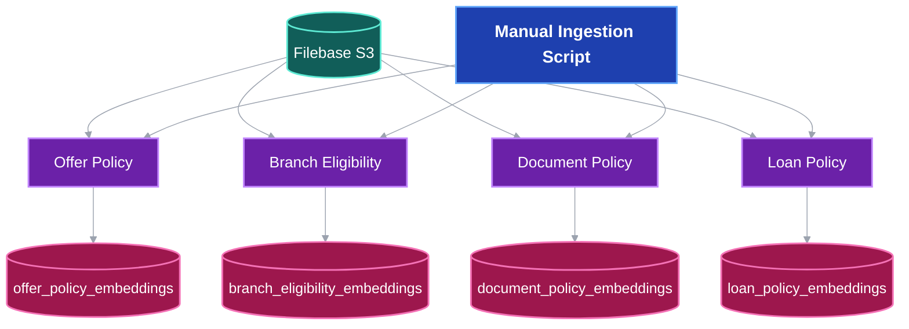

The ingestion process is intentionally separated from runtime execution. Policy documents are ingested manually when their source documents change, while runtime agents load the already-persisted vector indexes.

This prevents the application from repeatedly downloading and embedding policy documents whenever an agent is created.


## 3. Runtime RAG Flow

At runtime, the agents do not rebuild the vector indexes.

Instead, the corresponding query engine loads the existing pgvector index and performs similarity search against it.

The runtime flow is:

```mermaid
%%{init: {
    "theme": "base",
    "themeVariables": {
        "background": "#111827",
        "primaryColor": "#172033",
        "primaryTextColor": "#f9fafb",
        "primaryBorderColor": "#475569",
        "secondaryColor": "#172033",
        "secondaryTextColor": "#f9fafb",
        "secondaryBorderColor": "#475569",
        "tertiaryColor": "#172033",
        "tertiaryTextColor": "#f9fafb",
        "tertiaryBorderColor": "#475569",
        "lineColor": "#9ca3af",
        "textColor": "#f9fafb",
        "fontFamily": "Arial, sans-serif",
        "fontSize": "32px",

        "actorBkg": "#172033",
        "actorBorder": "#475569",
        "actorTextColor": "#f9fafb",

        "signalColor": "#9ca3af",
        "signalTextColor": "#f9fafb",

        "labelBoxBkgColor": "#172033",
        "labelBoxBorderColor": "#475569",
        "labelTextColor": "#f9fafb",

        "noteBkgColor": "#172033",
        "noteBorderColor": "#475569",
        "noteTextColor": "#f9fafb"
    }
}}%%

sequenceDiagram

    participant S as STUDENT
    participant A as SPECIALIST AGENTS
    participant T as QUERY TOOLS
    participant E as QUERY ENGINE
    participant V as PGVECTOR
    participant L as GEMINI

    S->>A: Ask policy question

    A->>T: Invoke policy lookup

    T->>E: Query

    E->>V: Similarity search

    V-->>E: Relevant chunks

    E-->>T: Policy context

    T-->>A: Retrieved context

    A->>L: Generate grounded answer

    L-->>A: Answer

    A-->>S: Response

    %% Same color scheme as architecture diagrams

    rect rgb(30, 64, 175)
        Note over S: User / Client
    end

    rect rgb(154, 52, 18)
        Note over A,T: Agent Layer
    end

    rect rgb(107, 33, 168)
        Note over E,V: RAG / Retrieval
    end

    rect rgb(17, 94, 89)
        Note over L: AI Model
    end

```

Each policy query engine is created from the corresponding persisted vector store.

The query engine uses:

```text
similarity_top_k = 4
```

Therefore, the query retrieves the most relevant policy chunks before the LLM generates the response.

### Policy Grounding

All policy query engines use a shared domain-specific prompt template.

The prompt instructs the model to:

* Use only the retrieved official policy context.
* Explicitly state when the context does not contain an answer.
* Avoid inventing rules, numbers, dates, or deadlines.
* Reproduce policy numbers exactly as they appear in the context.
* Provide concise and structured answers.

This shared prompt ensures that the four policy engines follow the same grounding and non-hallucination rules.


## 4. API Layer


The **API Layer** provides the HTTP interface for Student Support.

It is responsible for:

* Receiving the student's question.
* Validating the request.
* Authenticating the student where required.
* Resolving the student's application.
* Constructing the appropriate agent workflow.
* Streaming the agent response back to the client.

The API therefore acts as the boundary between the external client and the internal AI workflow.

For authenticated requests, the API resolves the student's application before constructing the specialist agents. The resulting `application_id` is passed internally to the query-tool factories rather than being supplied by the LLM or the student.

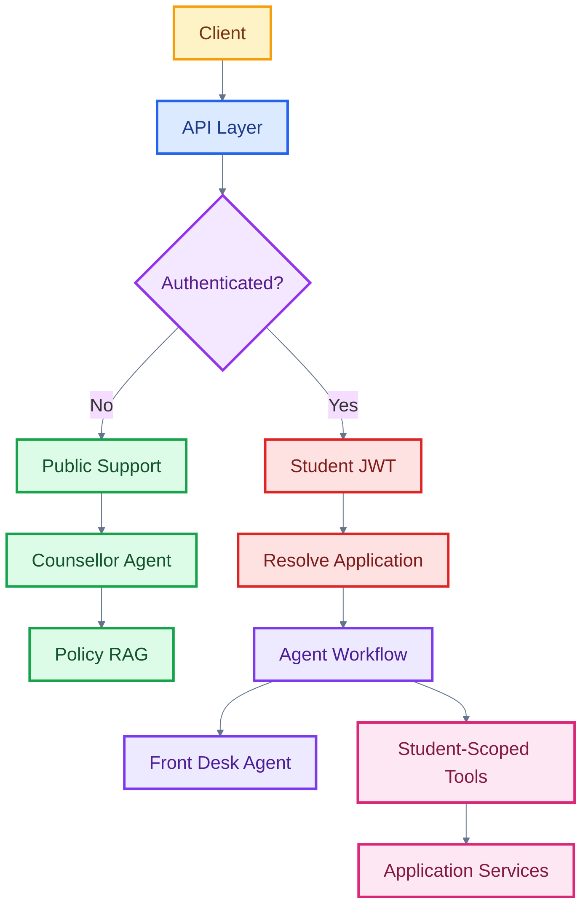

### 4.1 Public Support

```text
/support/public/chat/stream
```

The public endpoint uses only the `Counsellor Agent`.

It has access to policy RAG tools but has:

* No authentication
* No database access
* No personal application information
* No multi-agent orchestration

It is therefore suitable for general questions such as:

```text
What documents are required?
```

```text
What are the branch eligibility rules?
```

```text
How does shortlisting work?
```

```text
What is the education loan policy?
```

### 4.2 Authenticated Student Support

```text
/support/chat/stream
```

The authenticated endpoint requires a valid student JWT.

The server resolves the student's application before constructing the workflow.

The resulting `application_id` is passed into the specialist tool factories server-side.

The LLM therefore does not provide or control the application identifier.

## 5. Agent Orchestration

The authenticated workflow uses a Front Desk Agent as the entry point.

The Front Desk Agent does not answer substantive questions. Its primary responsibility is classification and routing.

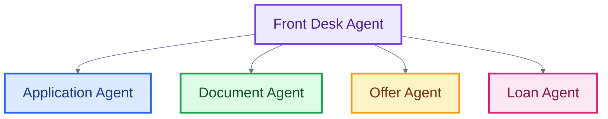
The workflow is implemented using LlamaIndex `AgentWorkflow`.

The Front Desk Agent receives the student's question and determines which specialist should handle it.

Its routing rules are:

| Question Type              | Specialist        |
| -------------------------- | ----------------- |
| Application status/history | Application Agent |
| Documents/validation       | Document Agent    |
| Offers/preferences/rounds  | Offer Agent       |
| Education loans            | Loan Agent        |

The Front Desk Agent has no database or policy tools.

This deliberately keeps the initial routing layer simple and prevents it from attempting to answer questions itself.

## 6. Specialist Agents

Each specialist agent is responsible for a specific domain of student support.

### 6.1 Application Agent

The Application Agent handles:

* Current application status.
* Application status history.
* Application validation issues.
* Policy questions related to application/document eligibility.


It has access to the following tools:

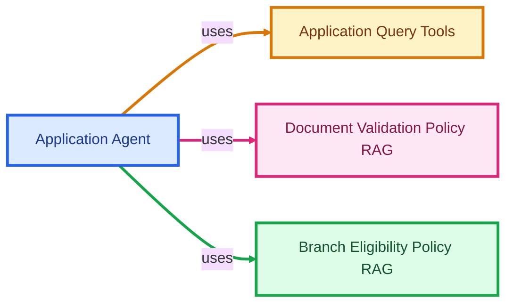

If application agent alone is incapable for some tasks or it requires support from other agents, it can also hand off the task to other special agents too.


The agent is explicitly instructed not to predict admission outcomes or chances.

---

### 6.2 Document Agent

The Document Agent handles questions concerning:

* Uploaded documents.
* Document validation status.
* Missing documents.
* Document validation issues.
* Document download links.
* Document submission requirements.

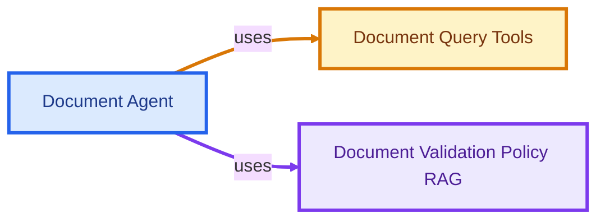

It can hand off questions concerning application status, offers, or loans to the appropriate specialists.

---

### 6.3 Offer Agent

The Offer Agent handles:

* Received offers.
* Offer status.
* Branch preferences.
* Shortlisting rounds.
* Branch information.
* Shortlisting and eligibility rules.

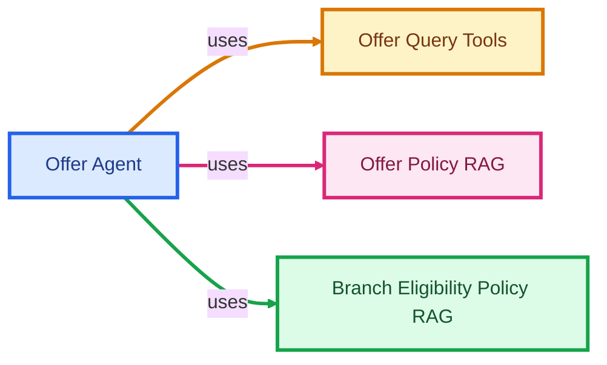

It is instructed to report actual recorded offers rather than predicting future offers or admission chances.

---

### 6.4 Loan Agent

The Loan Agent handles:

* The student's loan application status.
* Loan processing information.
* Education loan scheme rules.
* Loan eligibility.
* Loan documentation.
* Loan-related policy questions.

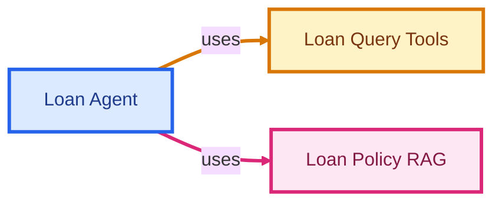

The agent cannot create, submit, or modify loan applications.

<br>

## 7. Agent-to-Agent Handoff

Specialist agents can hand questions to one another when additional domain-specific information is required.


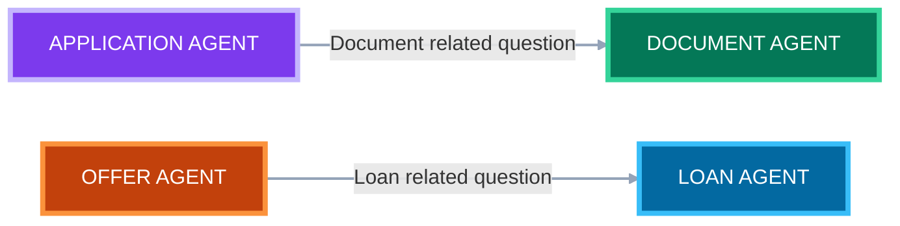

This allows the workflow to handle questions that span multiple domains without requiring the Front Desk Agent to repeatedly classify the conversation.

For example, a student may initially ask:

```
Why is my application still incomplete?
```

The Front Desk Agent may route the question to the **Application Agent**.

If the Application Agent determines that the answer requires document-specific information, it can hand the conversation to the **Document Agent**.

The specialist agents therefore form a **controlled handoff graph** rather than a collection of isolated agents.


## 8. Specialist Agents Using Database Query Tools

Student-specific information is not exposed to the agents through unrestricted database access.

Instead, each specialist receives a predefined set of `FunctionTool` instances.

The architecture is:

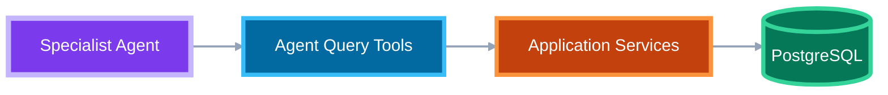

The tools call existing application services rather than directly querying database tables.

This preserves the application's existing service layer and keeps business logic outside the LLM.

### 8.1 Application Query Tools

The Application Agent can access tools for:

* Retrieving application status.
* Retrieving application status history.
* Inspecting validation issues.

### 8.2 Document Query Tools

The Document Agent can access tools for:

* Listing uploaded documents.
* Identifying missing documents.
* Generating document download links.
* Inspecting validation issues.

### 8.3 Offer Query Tools

The Offer Agent can access tools for:

* Retrieving student offers.
* Retrieving branch preferences.
* Checking whether a branch was offered.
* Retrieving general branch information.

### 8.4 Loan Query Tools

The Loan Agent can access the student's:

* Education loan application.
* Loan identifier.
* Loan processing status.


#### Here is the complete workflow how each specialist agent uses database query tools:

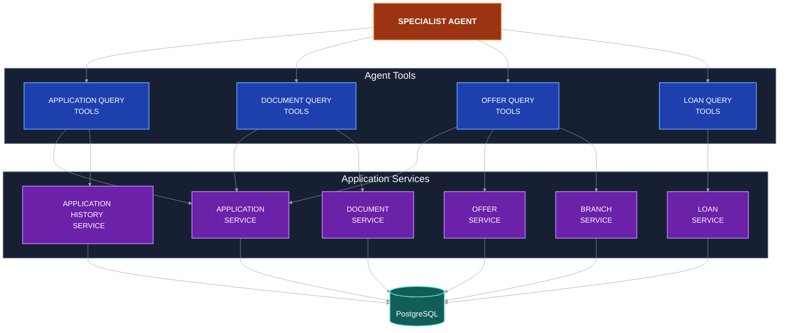


## 9. Application-Scoped Data Access

A key security property of the architecture is that `application_id` is resolved server-side.

The authenticated request first identifies the student from the JWT:

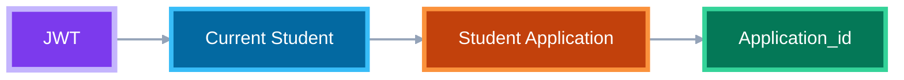

The application ID is then passed to the tool factories:

```python
build_application_query_tools(db, application_id)
build_document_query_tools(db, application_id)
build_offer_query_tools(db, application_id)
build_loan_query_tools(db, application_id)
```

The resulting functions close over this identifier.

Therefore, the LLM does not need to provide:

```text
application_id
student_id
```

as tool arguments.

This prevents the model from selecting another student's application through a tool parameter.

The tool layer is consequently scoped to the authenticated student's own application.

<br>

## 10. Separation of Policy Data and Application Data

The system deliberately separates two categories of information.

### Policy Information

Retrieved through:

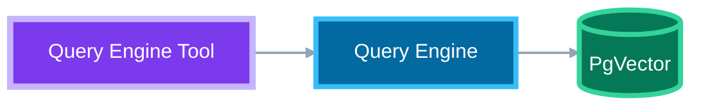

This information comes from official policy documents.

Examples include:

* Eligibility rules.
* Document requirements.
* Shortlisting rules.
* Loan scheme information.

### Student-Specific Information

Retrieved through:

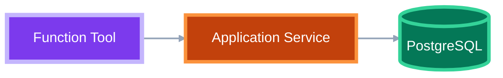

Examples include:

* Application status.
* Uploaded documents.
* Validation issues.
* Offers.
* Branch preferences.
* Loan status.

This separation allows the agent to combine policy context with the student's actual recorded state without giving the LLM unrestricted access to the database.

<br>


## 11. Streaming Workflow

The Student Support API uses Server-Sent Events (`text/event-stream`) to stream the agent's execution to the client.

During execution, the backend can emit several event types.

### Token Events

Generated response text is streamed incrementally:

```JSON
event: token
data: {"content": "..."}
```

This allows the frontend to display the response as it is generated.

### Agent Switch Events

When the workflow moves from one agent to another:

```JSON
event: agent_switch
data: {"agent": "document_agent"}
```

This allows the client to observe which specialist is currently handling the request.

### Tool Call Events

When an agent invokes a database or policy tool:

```JSON
event: tool_call
data: {
    "agent": "...",
    "tool": "..."
}
```

### Tool Result Events

When the tool returns:

```JSON
event: tool_result
data: {
    "agent": "...",
    "tool": "..."
}
```

### Completion Event

When the workflow finishes:

```JSON
event: done
data: {
    "handled_by": "..."
}
```
#### Here is the complete flow

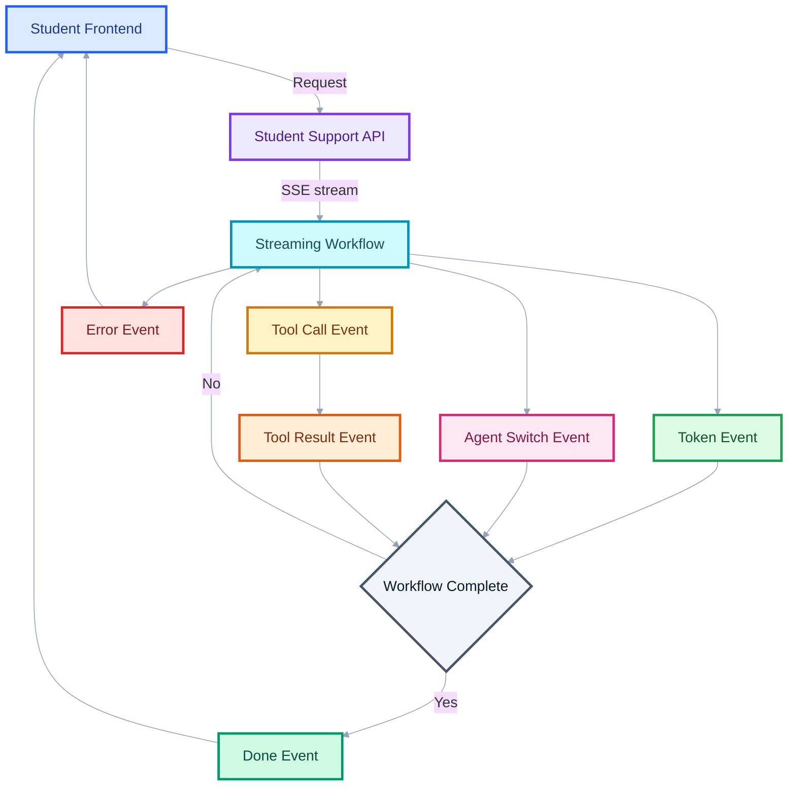


If an internal error occurs, the backend emits an error event rather than exposing internal exception details to the student.

<br>

# 12. Public Counsellor Workflow

The public endpoint uses a deliberately simpler architecture.

```text
Visitor
   │
   ▼
Public Support API
   │
   ▼
Counsellor Agent
   │
   ├── Loan Policy RAG
   ├── Offer Policy RAG
   ├── Document Policy RAG
   └── Branch Eligibility RAG
```

The public agent does not have:

```text
Database Tools
Student Application Access
Student Documents
Student Offers
Student Loan Status
```

It therefore cannot answer questions requiring personal account information.

For example, a public visitor asking:

```text
What documents are required?
```

can receive a policy-grounded response.

However, a question such as:

```text
What is the status of my application?
```

requires authentication and must be handled through the authenticated student support endpoint.

<br>

# 13. Workflow Design Principles

The Student Support architecture follows several important design principles.

#### 1. Policy Grounding

Policy-related answers are generated using retrieved official policy context rather than relying solely on the model's general knowledge.

#### 2. Application Isolation

Student-specific tools are created using the authenticated student's application ID.

#### 3. Service-Layer Reuse

Agent tools call existing application services instead of implementing database access and business logic independently.

#### 4. Domain Specialization

Each agent has a clearly defined responsibility, reducing the amount of unrelated context and tooling available to an individual agent.

#### 5. Controlled Handoffs

Agents can transfer domain-specific questions to another specialist when necessary.

#### 6. Public/Private Separation

The public counsellor and authenticated student workflow are separate paths with different capabilities.

#### 7. Runtime Efficiency

Policy documents are embedded during an explicit ingestion process. Runtime requests query the existing vector indexes rather than repeatedly downloading and embedding source PDFs.

#### 8. Streaming

The backend streams tokens, agent transitions, and tool execution events to provide visibility into the workflow and improve the responsiveness of the support interface.
