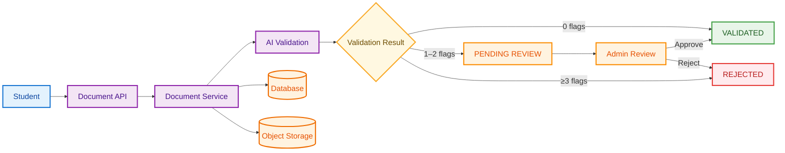
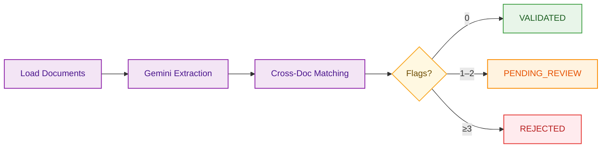
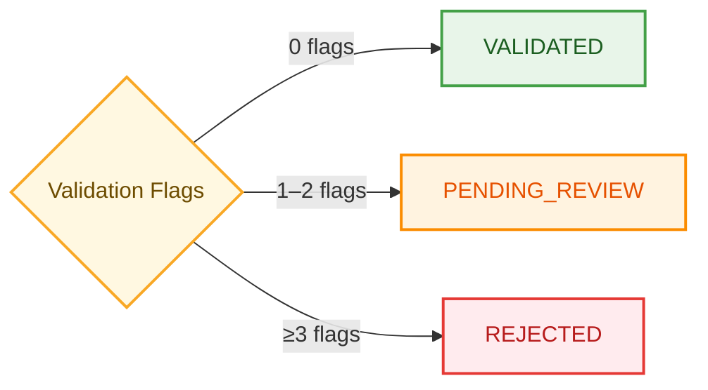
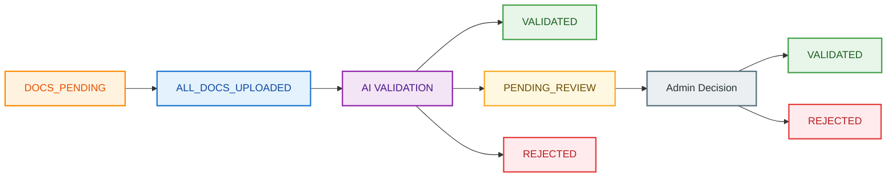
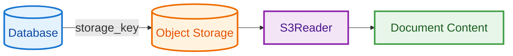
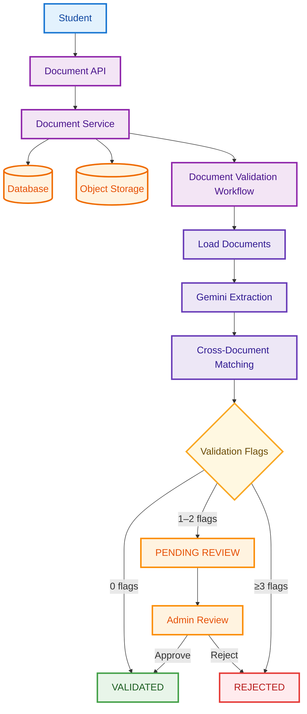

# Document Validation


### Table of Contents


1. [Overview](#1-overview) 
2. [Architecture](#2-architecture) 
3. [Supported Documents](#3-supported-documents) 
4. [Document Upload](#4-document-upload) 
5. [Document Replacement](#5-document-replacement) 
6. [Required Document Check](#6-required-document-check) 
7. [Requesting Validation](#7-requesting-validation) 
8. [AI Validation Workflow](#8-ai-validation-workflow) 
9. [Cross-Document Validation](#9-cross-document-validation) 
10. [Academic Marks Persistence](#10-academic-marks-persistence) 
11. [Validation Decision](#11-validation-decision) 
12. [Admin Review](#12-admin-review) 
13. [Application Status Lifecycle](#13-application-status-lifecycle) 
14. [Storage and Retrieval](#14-storage-and-retrieval) 
15. [Error Handling](#15-error-handling) 
16. [Human-in-the-Loop Design](#16-human-in-the-loop-design) 
17. [Key Design Characteristics](#17-key-design-characteristics) 
18. [Validation Lifecycle Summary](#18-validation-lifecycle-summary) 
19. [Summary](#19-summary) 

<br>


# 1. Overview

The Document Validation module is responsible for validating documents submitted as part of a student's admission application.

The system combines traditional application/database validation with an AI-powered document validation workflow.

The workflow:

1. Ensures all required documents have been uploaded.
2. Retrieves the uploaded documents from object storage.
3. Extracts structured information from the documents using Gemini.
4. Cross-checks the extracted information against other submitted documents and the student's registration data.
5. Calculates validation flags based on detected inconsistencies.
6. Automatically validates, rejects, or sends the application for manual review depending on the number of detected issues.
7. Persists extracted academic marks into the student's application data.

The current AI workflow specifically processes the **Class 12 marksheet** and **government ID card**. Other document types, such as the income certificate, are uploaded only during the loan application process.

<br>


# 2. Architecture

The document validation functionality is divided into several layers:



The **API layer** starts the process, while `DocumentService` handles document persistence and state changes.

`DocumentValidationWorkflow` performs the AI-based extraction and validation.

`AdminReviewService` handles human-in-the-loop decisions for applications that require manual review.

<br>

# 3. Supported Documents

The AI validation workflow currently supports structured extraction for two document types:

| Document | AI Validation |
|---|---|
| Class 12 Marksheet | Yes |
| Government ID Card | Yes |
| Income Certificate | No |
| Other documents | No |

The supported document types are mapped to their corresponding structured extraction schemas:

```text
CLASS12_MARKSHEET → Marksheet
ID_CARD           → GovernmentIDCard
```

Documents that are not present in this schema map are skipped by the AI workflow and are intended to be validated manually.

<br>

# 4. Document Upload

## Endpoint

```http
POST /documents/upload
```

The upload endpoint accepts:

- `doc_type`
- uploaded file
- validated content type

The endpoint obtains the currently authenticated student and delegates the actual upload operation to `DocumentService`.

## Upload Flow

```mermaid
%%{init: {'themeVariables': {'fontSize': '22px'}}}%%
flowchart LR
    A[Student]
    B[POST /documents/upload]
    C[File Type Validation]
    D[DocumentService]
    E[Application & Storage<br/>Preparation]
    F[Store File &<br/>Document Metadata]
    G[Validation Status:<br/>PENDING]

    A --> B --> C --> D --> E --> F --> G

    classDef actor fill:#E3F2FD,stroke:#1976D2,stroke-width:3px,color:#0D47A1,font-size:22px
    classDef api fill:#F3E5F5,stroke:#8E24AA,stroke-width:3px,color:#4A148C,font-size:22px
    classDef process fill:#FFF8E1,stroke:#F9A825,stroke-width:3px,color:#6D4C00,font-size:22px
    classDef storage fill:#FFF3E0,stroke:#EF6C00,stroke-width:3px,color:#E65100,font-size:22px
    classDef status fill:#E8F5E9,stroke:#43A047,stroke-width:3px,color:#1B5E20,font-size:22px

    class A actor
    class B,D api
    class C,E process
    class F storage
    class G status
```



A student must have an active application before a document can be uploaded.

If no application exists, the service returns:

```http
404 Not Found
```

The document is stored using a generated storage key, while the database stores metadata such as:

- application ID
- document type
- storage key
- content type
- file size
- validation status
- validation reason

Newly uploaded documents begin with:

```text
PENDING
```

validation status.

<br>

# 5. Document Replacement

If a student uploads another document of the same type, the existing document record is updated rather than creating another document of that type.

The new file:

- replaces the existing storage key
- updates the content type
- updates the file size
- resets validation status to `PENDING`
- clears the previous validation reason

The application status is also changed to:

```text
DOCS_PENDING
```

This means replacing a document correctly invalidates the previous validation result and requires the document to be validated again.

<br>

# 6. Required Document Check

Before starting AI validation, the system verifies that all required document types have been uploaded.

Currently, the required documents are:

```text
CLASS12_MARKSHEET
ID_CARD
```

The service retrieves all documents belonging to the application and checks whether these required types are present.

If all required documents exist, the application status is changed to:

```text
ALL_DOCS_UPLOADED
```

If one or more required documents are missing, validation cannot begin.

<br>

# 7. Requesting Validation

## Endpoint

```http
POST /documents/applications/{application_id}/documents/validate
```

The endpoint requires an authenticated student.

Before creating the AI workflow, the endpoint checks whether all required document types have been uploaded.

If they have not, the API returns:

```http
400 Bad Request
```

with:

```text
All document types not uploaded
```

Once the requirement is satisfied, a `DocumentValidationWorkflow` instance is created with:

- `DocumentService`
- `ApplicationRepository`
- `StudentRepository`
- LLM instance
- timeout
- workflow configuration

The workflow is then executed using the application ID.

<br>

# 8. AI Validation Workflow

The AI validation process is implemented using a workflow-based architecture.

`DocumentValidationWorkflow` receives an application ID and processes the documents through multiple stages:



The default rejection threshold is:

```text
3
```

<br>

## 8.1 Loading Documents

The first workflow step retrieves all documents associated with the application.

The workflow only processes documents that exist in its schema map:

```text
CLASS12_MARKSHEET
ID_CARD
```

Each document is loaded from object storage using `S3Reader`.

After loading, the document type is added to the document metadata so subsequent workflow stages know which extraction schema to use.

### Data Flow

```mermaid
flowchart LR
    A[Application ID]
    B[DocumentService]
    C[Document Records]
    D[Storage Keys]
    E[S3Reader]
    F[Document Content]

    A --> B --> C --> D --> E --> F

    classDef input fill:#E3F2FD,stroke:#1976D2,stroke-width:2px,color:#0D47A1
    classDef service fill:#F3E5F5,stroke:#8E24AA,stroke-width:2px,color:#4A148C
    classDef storage fill:#FFF3E0,stroke:#EF6C00,stroke-width:2px,color:#E65100
    classDef output fill:#E8F5E9,stroke:#43A047,stroke-width:2px,color:#1B5E20

    class A input
    class B service
    class C,D storage
    class E service
    class F output
```



<br>

## 8.2 Parallel Extraction Dispatch

After loading the documents, the workflow creates one extraction event for each document.

The workflow stores two values in its context:

```text
application_id
expected_count
```

It then dispatches a `DocExtractionRequestEvent` for every document.

Conceptually:

```text
Documents
   │
   ├── Marksheet ──────► Extraction Request
   │
   └── ID Card ────────► Extraction Request
```

This allows the documents to be processed independently.

<br>

## 8.3 Structured AI Extraction

Each document is processed by the `extract_single_document` workflow step.

The appropriate Pydantic schema is selected according to the document type:

```text
Class 12 Marksheet → Marksheet schema
Government ID      → GovernmentIDCard schema
```

The LLM is converted into a structured LLM using the selected schema:

```python
sllm = self.llm.as_structured_llm(schema)
```

The document content is then submitted to Gemini, and the resulting structured response is converted into a Python dictionary.

This prevents subsequent workflow stages from having to work with arbitrary natural-language model output.

Instead, they receive structured fields such as:

```text
Marksheet
├── student_name
├── dob
├── subject_wise_marks
├── total_marks
└── percentage

Government ID
├── full_name
└── dob
```

The exact fields are defined by the corresponding Pydantic schemas.

<br>

## 8.4 Parallelism

The extraction step is configured with:

```python
@step(num_workers=4)
```

Therefore, the workflow allows multiple document extraction events to be processed concurrently, with up to four workers for this step.

For the current two AI-validated document types, the marksheet and ID card extraction can proceed independently rather than requiring one document to finish before processing the other.

<br>

## 8.5 Collecting Extraction Results

The workflow must wait until all dispatched documents have completed extraction.

`expected_count` determines how many extraction results are required.

The workflow uses:

```text
ctx.collect_events(...)
```

to collect the expected number of `DocExtractedEvent` instances.

If the expected results have not arrived yet, the workflow waits.

Once all results are available, it creates an `AllExtractedEvent`.

This guarantees that cross-document validation only begins after all relevant documents have been extracted.

<br>

# 9. Cross-Document Validation

The extracted information is passed to:

```text
cross_match_documents()
```

The function compares:

1. Marksheet against ID card
2. Application registration data against marksheet
3. Application registration data against ID card

## 9.1 Name Validation

The following comparisons are performed:

```text
Marksheet name ↔ ID card name
Registration name ↔ Marksheet name
Registration name ↔ ID card name
```

Each mismatch produces one validation flag.

### Name Normalization

Names are normalized before comparison.

The normalization process:

1. Removes leading/trailing whitespace.
2. Converts the name to lowercase.
3. Collapses multiple spaces.

For example:

```text
"  Rahul   Kumar "
```

becomes:

```text
"rahul kumar"
```

The normalized strings are then compared for equality.

If either value is missing, the comparison is skipped rather than generating a mismatch.

<br>

## 9.2 Date of Birth Validation

The following comparisons are performed:

```text
Marksheet DOB ↔ ID card DOB
Registration DOB ↔ ID card DOB
Registration DOB ↔ Marksheet DOB
```

Dates are compared by converting them to strings and checking equality.

If either date is missing, the comparison is skipped.

The current validation therefore checks consistency of the available DOB values rather than attempting fuzzy date matching.

<br>

## 9.3 Validation Flags

Validation issues are represented by `CrossMatchResult`.

```text
CrossMatchResult
├── flags
└── issues
```

Whenever a mismatch is detected:

```python
result.add(issue)
```

increments the flag count and records the issue.

For example, an application could produce:

```text
flags = 2

issues:
- name mismatch between application and ID
- dob mismatch between marksheet and ID
```

The issues are finally converted into a comma-separated string for persistence.

<br>

# 10. Academic Marks Persistence

During the validation stage, the extracted marksheet information is also persisted to the student's record.

Before persistence, the raw LLM output is passed back through the actual `Marksheet` Pydantic schema.

This ensures that calculated fields such as total marks and percentage are validated by the application's schema rather than blindly trusting the raw LLM output.

The following values are stored:

```text
Physics
Chemistry
Mathematics
English
Computer Science
Total Marks
Percentage
```

The student repository is subsequently used to save the updated student record.

Importantly, this persistence occurs regardless of whether the cross-match ultimately produces validation flags.

<br>

# 11. Validation Decision

After cross-document matching, the workflow routes the application according to the number of validation flags.



The default threshold is:

```text
3
```

Therefore:

| Validation Flags | Result |
|---:|---|
| `0` | Automatically validated |
| `1–2` | Pending manual review |
| `≥3` | Automatically rejected |

<br>

## 11.1 Automatic Validation

If:

```text
flags == 0
```

the application is automatically marked as validated.

The service:

- changes the application status to `VALIDATED`
- records the status change as performed by `AI`
- marks the processed documents as `VALID`
- clears their validation reasons

The workflow returns:

```json
{
    "status": "validated",
    "flags": 0,
    "issues": ""
}
```

The corresponding document validation status is persisted as:

```text
VALID
```

<br>

## 11.2 Human-in-the-Loop Review

If:

```text
0 < flags < threshold
```

the application enters:

```text
PENDING_REVIEW
```

With the current threshold of `3`:

```text
1 or 2 flags → manual review
```

The system stores:

- validation flags
- validation issues
- application status
- status history

The individual documents intentionally remain `PENDING` because the AI has detected a grey-zone case that requires a human decision.

This is the human-in-the-loop component of the validation system.

<br>

## 11.3 Automatic Rejection

If:

```text
flags >= threshold
```

the application is automatically rejected.

With the current default threshold:

```text
flags >= 3
```

results in rejection.

The application:

- receives `REJECTED` status
- stores the validation issues
- records the status transition as performed by `AI`
- marks the processed documents as `INVALID`
- stores the rejection reason against the documents

The workflow returns:

```json
{
    "status": "rejected",
    "flags": 3,
    "issues": "..."
}
```

The exact flag count and issue string depend on the mismatches detected during cross-document matching.

<br>

# 12. Admin Review

Applications in `PENDING_REVIEW` can be inspected through the admin document review API.

## 12.1 List Pending Reviews

```http
GET /admin/document-reviews/
```

The endpoint retrieves applications whose status is:

```text
PENDING_REVIEW
```

For every application, the system creates download links for the Class 12 marksheet and ID card and returns information including:

- application ID
- submission time
- application status
- validation flags
- validation issues
- update time
- marksheet download link
- ID card download link

The endpoint is protected using the authenticated officer dependency.

<br>

## 12.2 Submitting an Admin Decision

```http
POST /admin/document-reviews/{application_id}/decision
```

The request body contains:

```json
{
    "approve": true
}
```

or:

```json
{
    "approve": false
}
```

The application must currently be in:

```text
PENDING_REVIEW
```

Otherwise, the API returns:

```http
404 Not Found
```

with:

```text
No pending review found for this application.
```

<br>

## 12.3 Admin Approval

If:

```json
{
    "approve": true
}
```

the system calls:

```text
validate_application_manually()
```

The admin review service:

- retrieves the application
- retrieves all documents
- marks applicable documents as `VALID`
- sets the validation reason to indicate manual validation
- resets validation flags to `0`
- clears validation issues
- updates application status to `VALIDATED`
- records the status transition as performed by `admin`

The income certificate is explicitly excluded from this mass-validation operation.

<br>

## 12.4 Admin Rejection

If:

```json
{
    "approve": false
}
```

the system calls:

```text
reject_application_manually()
```

The applicable documents are marked:

```text
INVALID
```

with the reason:

```text
Data mismatch issues
```

The application is then moved to:

```text
REJECTED
```

and the status transition is recorded as performed by `admin`.

<br>

# 13. Application Status Lifecycle

The document validation system interacts with the following application states:



The application-level status is separate from the document-level validation status.

This separation allows the system to represent both:

- the overall admission application state
- the validation state of individual uploaded documents

<br>

# 14. Storage and Retrieval

Documents are not processed directly from the database.

The database stores document metadata and a `storage_key`, while the actual file is stored in object storage.

The retrieval flow is:



The service also supports:

- fetching raw document bytes
- generating pre-signed download URLs

Pre-signed URLs allow the admin interface to access documents without exposing the underlying storage location directly.

<br>

# 15. Error Handling

The document subsystem handles several failure conditions.

### No Application

If a student attempts to upload a document without an active application:

```text
404 Not Found
```

### Storage Upload Failure

If the document cannot be uploaded to object storage:

```text
502 Bad Gateway
```

### Storage Retrieval Failure

If a stored document cannot be retrieved:

```text
502 Bad Gateway
```

### Missing Required Documents

If all required documents have not been uploaded:

```text
400 Bad Request
```

### Missing Application During Validation

If an application cannot be found while updating validation results:

```text
404 Not Found
```

These errors prevent the validation pipeline from silently continuing with incomplete or unavailable data.

<br>

# 16. Human-in-the-Loop Design

The validation system deliberately does not attempt to automatically resolve every discrepancy.

Instead, it divides results into three categories:

| Result | Interpretation | Action |
|---|---|---|
| `0` flags | No detected inconsistencies | Automatically validate |
| `1–2` flags | Potential inconsistency | Human review |
| `≥3` flags | Multiple inconsistencies | Automatically reject |

This design reduces unnecessary manual work for clearly valid applications while ensuring that borderline cases can still be reviewed by an admission officer.

<br>

# 17. Key Design Characteristics

### 1. AI-Assisted, Not AI-Only

The LLM performs structured information extraction, but the final validation decision is based on deterministic cross-document matching logic and a configurable flag threshold.

### 2. Structured Extraction

The LLM is constrained through Pydantic schemas rather than being asked to return arbitrary text.

### 3. Cross-Document Verification

Information is compared across multiple sources instead of validating each document in isolation.

### 4. Registration-Data Verification

Extracted document information is also compared against the student's application data.

### 5. Parallel Document Processing

Document extraction uses multiple workflow workers, allowing independent documents to be processed concurrently.

### 6. Human-in-the-Loop

Borderline cases are explicitly routed to admission officers instead of being automatically accepted or rejected.

### 7. State Persistence

Both application-level and document-level validation states are persisted in the database.

### 8. Audit Trail

Application status transitions are recorded in application status history, with the source of the transition identified as either `AI` or `admin`.

---

# 18. Validation Lifecycle Summary

The complete document validation lifecycle is:



Applications entering `PENDING_REVIEW` are subsequently resolved by an admission officer through the admin review API.

<br>

# 19. Summary

The Document Validation module implements an AI-assisted, workflow-driven validation pipeline for student admission documents.

The architecture combines:

- object storage
- database persistence
- structured LLM extraction
- deterministic cross-document validation
- workflow orchestration
- parallel document processing
- human-in-the-loop review
- application and document state management
- audit history

The implementation currently applies automated AI validation to:

```text
CLASS12_MARKSHEET
ID_CARD
```

The workflow extracts structured information from these documents, compares the extracted data with other submitted documents and registration data, calculates validation flags, and routes the application according to the configured threshold.

This design combines the flexibility of AI-based document understanding with deterministic validation rules and human oversight, allowing straightforward applications to be processed automatically while routing ambiguous cases to admission officers.