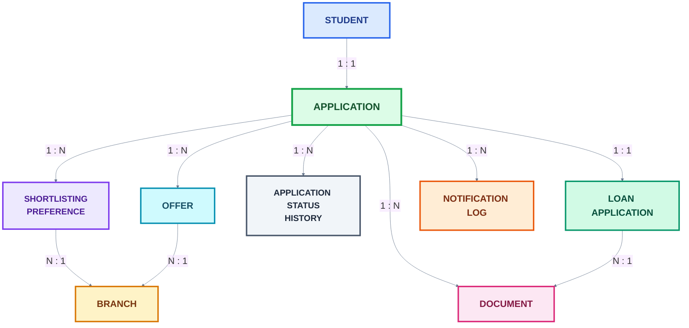
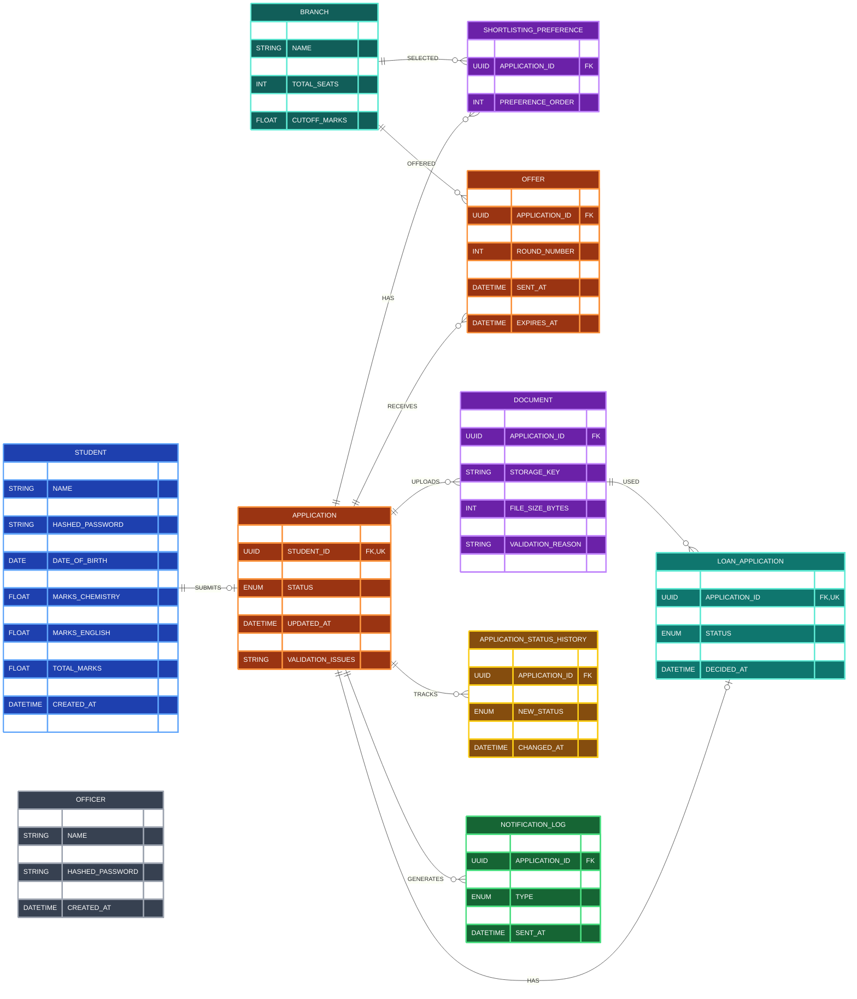
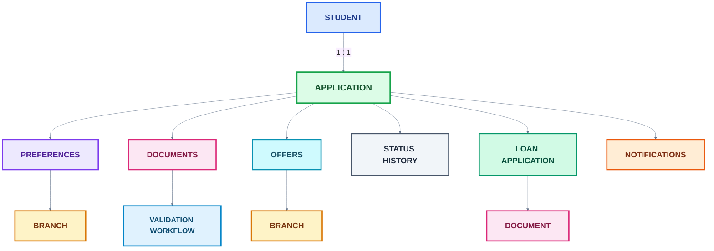

# Domain Model

### Table of Contents

1. [Overview](#1-overview)
2. [Entity Overview](#2-entity-overview)
3. [Common Design Patterns](#3-common-design-patterns)
   - [3.1 UUID Primary Keys](#31-uuid-primary-keys)
   - [3.2 UTC Timestamps](#32-utc-timestamps)
4. [Student](#4-student)
5. [Officer](#5-officer)
6. [Branch](#6-branch)
7. [Application](#7-application)
8. [Shortlisting Preference](#8-shortlisting-preference)
9. [Document](#9-document)
10. [Application Status History](#10-application-status-history)
11. [Notification Log](#11-notification-log)
12. [Loan Application](#12-loan-application)
13. [Offer](#13-offer)
14. [ER Diagram](#14-er-diagram)
15. [Enum-Based Domain Rules](#15-enum-based-domain-rules)
16. [Cascading and Referential Integrity](#16-cascading-and-referential-integrity)
17. [Domain Model Summary](#17-domain-model-summary)

## 1. Overview

The domain model defines the core entities of the admission management system and maps them to relational database tables using **SQLAlchemy ORM**.

The model represents the complete admission lifecycle, beginning with student registration and application submission and continuing through:

* Branch preference selection
* Document upload and validation
* Application status tracking
* Shortlisting and seat allocation
* Offer management
* Loan processing
* Notification tracking

All primary entities use **PostgreSQL UUIDs** as their primary keys. The system also uses timezone-aware UTC timestamps for auditability and consistent time handling.

The domain model is implemented in:

```text
app/models/domain.py
```

The enumeration values used by the models are defined separately in:

```text
app/models/enums.py
```

<br>

# 2. Entity Overview

The main entities in the domain are:

| Entity                     | Purpose                                                             |
| -------------------------- | ------------------------------------------------------------------- |
| `Student`                  | Stores student account, personal, and academic information          |
| `Officer`                  | Stores admission officer and administrator accounts                 |
| `Branch`                   | Represents an academic branch and its seat availability             |
| `Application`              | Represents a student's admission application                        |
| `ShortlistingPreference`   | Stores the branch preferences selected by an applicant              |
| `Document`                 | Stores metadata and validation information for uploaded documents   |
| `ApplicationStatusHistory` | Maintains an audit trail of application status changes              |
| `NotificationLog`          | Records notifications sent to applicants                            |
| `LoanApplication`          | Represents an education-loan request associated with an application |
| `Offer`                    | Represents a branch admission offer made during a counselling round |

The high-level relationship can be represented as:



<br>


# 3. Common Design Patterns

## 3.1 UUID Primary Keys

All major entities use PostgreSQL UUIDs:

```python
id: Mapped[uuid.UUID] = mapped_column(
    UUID(as_uuid=True),
    primary_key=True,
    default=uuid.uuid4
)
```

UUIDs provide globally unique identifiers without relying on sequential database-generated integers.

<br>

## 3.2 UTC Timestamps

The system uses a shared helper:

```python
def get_utc_now() -> datetime:
    return datetime.now(timezone.utc)
```

This ensures timestamps are generated using UTC and stored as timezone-aware `DateTime` values.

The helper is used for fields such as:

* `created_at`
* `updated_at`
* `submitted_at`
* `uploaded_at`
* `sent_at`
* `changed_at`
* `decided_at`
* `responded_at`
* `expires_at`

This provides consistent timestamp handling across the application.

<br>

# 4. Student

The `Student` entity represents a student registered in the admission system.

### Table

```text
students
```

### Fields

| Field                    | Type        | Constraints               | Description                    |
| ------------------------ | ----------- | ------------------------- | ------------------------------ |
| `id`                     | UUID        | Primary Key               | Unique student identifier      |
| `name`                   | String(100) | Not Null                  | Student's name                 |
| `email`                  | String(150) | Unique, Indexed, Not Null | Login/contact email            |
| `hashed_password`        | String(255) | Not Null                  | Hashed authentication password |
| `phone`                  | String(20)  | Nullable                  | Student's phone number         |
| `date_of_birth`          | Date        | Nullable                  | Student's date of birth        |
| `marks_physics`          | Float       | Nullable                  | Physics marks                  |
| `marks_chemistry`        | Float       | Nullable                  | Chemistry marks                |
| `marks_maths`            | Float       | Nullable                  | Mathematics marks              |
| `marks_english`          | Float       | Nullable                  | English marks                  |
| `marks_computer_science` | Float       | Nullable                  | Computer Science marks         |
| `total_marks`            | Float       | Nullable                  | Total marks                    |
| `marks_percentage`       | Float       | Nullable                  | Overall percentage             |
| `created_at`             | DateTime    | Not Null                  | Account creation timestamp     |
| `updated_at`             | DateTime    | Not Null                  | Last update timestamp          |

### Relationship

A student can have one admission application:

```text
Student 1 ───── 1 Application
```

The relationship is implemented using:

```python
application = relationship(
    "Application",
    back_populates="student",
    cascade="all, delete-orphan"
)
```

The `Application.student_id` column is unique, enforcing the one-to-one relationship at the database level.

<br>

# 5. Officer

The `Officer` entity represents users who operate the admission administration system.

### Table

```text
officers
```

### Fields

| Field             | Type        | Constraints               | Description                |
| ----------------- | ----------- | ------------------------- | -------------------------- |
| `id`              | UUID        | Primary Key               | Unique officer identifier  |
| `name`            | String(100) | Not Null                  | Officer name               |
| `email`           | String(150) | Unique, Indexed, Not Null | Officer login email        |
| `hashed_password` | String(255) | Not Null                  | Hashed password            |
| `role`            | Enum        | Not Null                  | Officer's system role      |
| `created_at`      | DateTime    | Not Null                  | Account creation timestamp |


<br>

# 6. Branch

The `Branch` entity represents an academic branch for which students can apply.

### Table

```text
branches
```

### Fields

| Field             | Type        | Constraints               | Description                          |
| ----------------- | ----------- | ------------------------- | ------------------------------------ |
| `id`              | UUID        | Primary Key               | Branch identifier                    |
| `name`            | String(100) | Not Null                  | Branch name                          |
| `code`            | String(20)  | Unique, Indexed, Not Null | Branch code                          |
| `total_seats`     | Integer     | Not Null                  | Total seats available for the branch |
| `available_seats` | Integer     | Not Null                  | Currently available seats            |
| `cutoff_marks`    | Float       | Nullable                  | Current/defined cutoff marks         |

The branch is referenced by both applicant preferences and admission offers.

```text
Branch
  ▲
  │
  ├── ShortlistingPreference
  │
  └── Offer
```

<br>

# 7. Application

The `Application` entity is the central entity of the admission workflow.

### Table

```text
applications
```

### Fields

| Field               | Type     | Constraints          | Description                         |
| ------------------- | -------- | -------------------- | ----------------------------------- |
| `id`                | UUID     | Primary Key          | Application identifier              |
| `student_id`        | UUID     | FK, Unique, Not Null | Associated student                  |
| `total_marks`       | Float    | Not Null             | Marks used for admission evaluation |
| `status`            | Enum     | Indexed              | Current application status          |
| `submitted_at`      | DateTime | Not Null             | Application submission timestamp    |
| `updated_at`        | DateTime | Not Null             | Last update timestamp               |
| `validation_flags`  | Integer  | Nullable             | Validation-related flags            |
| `validation_issues` | String   | Nullable             | Description of validation issues    |

### Application Status

The application lifecycle is represented by `ApplicationStatus`.

Important states include:

```text
STARTED
SUBMITTED
DOCS_PENDING
ALL_DOCS_UPLOADED

VALIDATED
REJECTED
PENDING_REVIEW

OFFER_MADE
OFFER_ACCEPTED
OFFER_REJECTED
OFFER_EXPIRED
WITHDRAWN
```

The status allows the system to track an application from initial creation through document processing, validation, and admission offers.

### Relationships

An application is associated with:

```text
Application
   │
   ├── Student
   ├── ShortlistingPreference [0..N]
   ├── Document [0..N]
   ├── Offer [0..N]
   ├── ApplicationStatusHistory [0..N]
   ├── LoanApplication [0..1]
   └── NotificationLog [0..N]
```

Cascade delete is configured for the ORM-owned child collections, ensuring dependent records are removed when an application is deleted.

<br>

# 8. Shortlisting Preference

`ShortlistingPreference` stores the branch preferences selected by a student.

### Table

```text
shortlisting_preferences
```

### Fields

| Field              | Type    | Constraints           | Description                  |
| ------------------ | ------- | --------------------- | ---------------------------- |
| `id`               | UUID    | Primary Key           | Preference identifier        |
| `application_id`   | UUID    | Foreign Key, Not Null | Associated application       |
| `branch_id`        | UUID    | Foreign Key, Not Null | Selected branch              |
| `preference_order` | Integer | Not Null              | Priority/order of the branch |

For example:

```text
Application
    │
    ├── Preference 1 → CSE
    ├── Preference 2 → ECE
    └── Preference 3 → ME
```

### Constraints

Two unique constraints prevent duplicate preferences:

```text
uq_application_pref_order
```

ensures that an application cannot have two branches with the same preference order.

```text
uq_application_branch
```

ensures that the same branch cannot be selected more than once by an application.

Therefore:

```text
Same application + same preference order → Not allowed
Same application + same branch          → Not allowed
```

<br>

# 9. Document

The `Document` entity stores metadata about documents submitted by an applicant.

### Table

```text
documents
```

### Fields

| Field               | Type        | Constraints           | Description                  |
| ------------------- | ----------- | --------------------- | ---------------------------- |
| `id`                | UUID        | Primary Key           | Document identifier          |
| `application_id`    | UUID        | Foreign Key, Not Null | Associated application       |
| `doc_type`          | Enum        | Not Null              | Type of submitted document   |
| `storage_key`       | String(500) | Not Null              | Object-storage location/key  |
| `content_type`      | String(150) | Not Null              | MIME type                    |
| `file_size_bytes`   | Integer     | Not Null              | File size                    |
| `validation_status` | Enum        | Not Null              | Current validation state     |
| `validation_reason` | String(500) | Nullable              | Reason for validation result |
| `uploaded_at`       | DateTime    | Not Null              | Upload timestamp             |

### Document Types

The supported document types are:

```text
CLASS12_MARKSHEET
ID_CARD
INCOME_CERTIFICATE
OTHER
```

### Validation Status

Documents move through:

```text
PENDING
   │
   ├──► VALID
   │
   └──► INVALID
```

The `validation_reason` field stores additional information when a document is invalid or requires explanation.

### Object Storage

The database does **not** directly store the document contents.

Instead, `storage_key` identifies the object in external storage.

The conceptual flow is:

```mermaid
%%{init: {
  "theme": "base",
  "themeVariables": {
    "fontFamily": "Arial, sans-serif",
    "fontSize": "26px",
    "textColor": "#0f172a",
    "lineColor": "#64748b"
  },
  "flowchart": {
    "htmlLabels": false,
    "curve": "linear",
    "nodeSpacing": 70,
    "rankSpacing": 90,
    "padding": 30
  }
}}%%

flowchart LR

    DATABASE["DATABASE"]
    STORAGE["OBJECT STORAGE"]
    READER["DOCUMENT READER"]
    CONTENT["DOCUMENT CONTENT"]
    VALIDATION["VALIDATION WORKFLOW"]

    DATABASE -->|"storage_key"| STORAGE
    STORAGE --> READER
    READER --> CONTENT
    CONTENT --> VALIDATION

    classDef database fill:#dbeafe,stroke:#2563eb,stroke-width:4px,color:#1e3a8a,font-size:26px,font-weight:bold;
    classDef storage fill:#fef3c7,stroke:#d97706,stroke-width:4px,color:#78350f,font-size:26px,font-weight:bold;
    classDef reader fill:#ede9fe,stroke:#7c3aed,stroke-width:4px,color:#4c1d95,font-size:26px,font-weight:bold;
    classDef content fill:#fce7f3,stroke:#db2777,stroke-width:4px,color:#831843,font-size:26px,font-weight:bold;
    classDef validation fill:#dcfce7,stroke:#16a34a,stroke-width:4px,color:#14532d,font-size:26px,font-weight:bold;

    class DATABASE database
    class STORAGE storage
    class READER reader
    class CONTENT content
    class VALIDATION validation
```



This separates document metadata from the actual file storage layer.

<br>

# 10. Application Status History

`ApplicationStatusHistory` provides an audit trail for application status changes.

### Table

```text
application_status_history
```

### Fields

| Field            | Type        | Constraints           | Description                      |
| ---------------- | ----------- | --------------------- | -------------------------------- |
| `id`             | UUID        | Primary Key           | History record identifier        |
| `application_id` | UUID        | Foreign Key, Not Null | Associated application           |
| `old_status`     | Enum        | Nullable              | Previous application status      |
| `new_status`     | Enum        | Not Null              | New application status           |
| `changed_by`     | String(100) | Nullable              | Actor responsible for the change |
| `changed_at`     | DateTime    | Not Null              | Time of status change            |

The first status transition may have no previous status, which is why `old_status` is nullable.

`changed_by` can represent either:

```text
SYSTEM
```

or an officer identifier.

### Example

```mermaid
%%{init: {
  "theme": "base",
  "themeVariables": {
    "fontFamily": "Arial, sans-serif",
    "fontSize": "18px",
    "textColor": "#0f172a",
    "lineColor": "#64748b"
  },
  "flowchart": {
    "htmlLabels": false,
    "curve": "linear",
    "nodeSpacing": 35,
    "rankSpacing": 45,
    "padding": 15
  }
}}%%

flowchart LR

    STARTED["STARTED"]
    SUBMITTED["SUBMITTED"]
    DOCS_PENDING["DOCS_PENDING"]
    ALL_DOCS_UPLOADED["ALL_DOCS_UPLOADED"]
    VALIDATED["VALIDATED"]
    OFFER_MADE["OFFER_MADE"]

    STARTED --> SUBMITTED
    SUBMITTED --> DOCS_PENDING
    DOCS_PENDING --> ALL_DOCS_UPLOADED
    ALL_DOCS_UPLOADED --> VALIDATED
    VALIDATED --> OFFER_MADE

    classDef started fill:#dbeafe,stroke:#2563eb,stroke-width:2px,color:#1e3a8a,font-size:18px;
    classDef submitted fill:#e0f2fe,stroke:#0284c7,stroke-width:2px,color:#0c4a6e,font-size:18px;
    classDef docs fill:#ede9fe,stroke:#7c3aed,stroke-width:2px,color:#4c1d95,font-size:18px;
    classDef uploaded fill:#fef3c7,stroke:#d97706,stroke-width:2px,color:#78350f,font-size:18px;
    classDef validated fill:#dcfce7,stroke:#16a34a,stroke-width:2px,color:#14532d,font-size:18px;
    classDef offer fill:#cffafe,stroke:#0891b2,stroke-width:2px,color:#164e63,font-size:18px;

    class STARTED started
    class SUBMITTED submitted
    class DOCS_PENDING docs
    class ALL_DOCS_UPLOADED uploaded
    class VALIDATED validated
    class OFFER_MADE offer
```



Each transition can produce a corresponding history record.

This allows the system to answer questions such as:

* What was the previous application status?
* When did the status change?
* Who or what changed it?

<br>

# 11. Notification Log

`NotificationLog` records notifications generated by the system.

### Table

```text
notification_logs
```

### Fields

| Field             | Type        | Constraints | Description             |
| ----------------- | ----------- | ----------- | ----------------------- |
| `id`              | UUID        | Primary Key | Notification identifier |
| `application_id`  | UUID        | Nullable FK | Associated application  |
| `recipient_email` | String(150) | Not Null    | Notification recipient  |
| `type`            | Enum        | Not Null    | Notification category   |
| `status`          | Enum        | Not Null    | Delivery status         |
| `sent_at`         | DateTime    | Not Null    | Notification timestamp  |

### Notification Types

```text
SHORTLIST_OFFER
LOAN_APPROVAL
WAITLIST_UPDATE
REJECTION
```

### Notification Status

```text
SENT
FAILED
```

The application relationship is nullable, allowing the notification system to retain logs even for notifications that may not require a directly associated application.

<br>

# 12. Loan Application

`LoanApplication` represents an education-loan request associated with an admission application.

### Table

```text
loan_applications
```

### Fields

| Field                       | Type     | Constraints                   | Description                                  |
| --------------------------- | -------- | ----------------------------- | -------------------------------------------- |
| `id`                        | UUID     | Primary Key                   | Loan application identifier                  |
| `application_id`            | UUID     | Foreign Key, Unique, Not Null | Associated admission application             |
| `income_certificate_doc_id` | UUID     | Foreign Key, Not Null         | Income certificate used for processing       |
| `status`                    | Enum     | Not Null                      | Loan processing status                       |
| `extracted_annual_income`   | Float    | Nullable                      | Annual income extracted from the certificate |
| `decided_at`                | DateTime | Nullable                      | Decision timestamp                           |

### Loan Status

The loan lifecycle is represented by:

```text
NOT_REQUESTED
PENDING
APPROVED
REJECTED
```

### Relationship

The `application_id` is unique, establishing a one-to-one relationship:

```text
Application 1 ───── 1 LoanApplication
```

The loan application also references a document containing the applicant's income certificate.

<br>

# 13. Offer

The `Offer` entity represents an admission offer made to a student for a particular branch during a counselling round.

### Table

```text
offers
```

### Fields

| Field            | Type     | Constraints           | Description                   |
| ---------------- | -------- | --------------------- | ----------------------------- |
| `id`             | UUID     | Primary Key           | Offer identifier              |
| `application_id` | UUID     | Foreign Key, Not Null | Applicant's application       |
| `branch_id`      | UUID     | Foreign Key, Not Null | Offered branch                |
| `round_number`   | Integer  | Indexed, Not Null     | Counselling round             |
| `status`         | Enum     | Indexed               | Current offer status          |
| `sent_at`        | DateTime | Not Null              | Time offer was generated/sent |
| `responded_at`   | DateTime | Nullable              | Time student responded        |
| `expires_at`     | DateTime | Not Null              | Offer expiry time             |

### Offer Status

```text
PENDING
ACCEPTED
REJECTED
EXPIRED
```

### Counselling Rounds

`round_number` identifies the counselling round in which the offer was generated.

For example:

```text
Round 1 → Offer
Round 2 → Offer
Round 3 → Offer
```

This allows the admission system to maintain offer history across multiple rounds.

### Duplicate Prevention

The following unique constraint is defined:

```text
uq_offer_application_round
```

It enforces:

```text
One application + one round = at most one offer
```

This protects the system against accidentally generating duplicate offers if the shortlisting process for the same round is triggered more than once.

<br>

# 14. ER Diagram



# 15. Enum-Based Domain Rules

The domain model uses Python `Enum` classes mapped to PostgreSQL enum types through SQLAlchemy.

The major enums are:

| Enum                 | Purpose                                     |
| -------------------- | ------------------------------------------- |
| `ApplicationStatus`  | Defines the admission application lifecycle |
| `DocumentType`       | Defines supported document categories       |
| `ValidationStatus`   | Defines document validation results         |
| `OfferStatus`        | Defines admission offer states              |
| `NotificationType`   | Defines notification categories             |
| `NotificationStatus` | Defines notification delivery state         |
| `LoanStatus`         | Defines loan-processing state               |

Using enums prevents arbitrary string values from being stored in these fields and provides a controlled set of valid domain states.

<br>

# 16. Cascading and Referential Integrity

The ORM relationships use cascading behavior for application-owned entities.

For example:

```python
cascade="all, delete-orphan"
```

is used for:

* Application → Preferences
* Application → Documents
* Application → Offers
* Application → Status History
* Application → Loan Application
* Student → Application

This means dependent ORM entities are treated as children of their parent entity.

For example:

```text
Delete Application
       │
       ├── Delete Preferences
       ├── Delete Documents
       ├── Delete Offers
       ├── Delete Status History
       └── Delete Loan Application
```

This prevents orphaned child records from remaining in the ORM-managed domain.

<br>

# 17. Domain Model Summary

The domain model is centered around the `Application` entity.

A simplified representation is:



The model therefore provides the persistent domain foundation for the complete admission workflow: **student registration → application → document submission and validation → preference-based shortlisting → offers → acceptance/rejection → loan and notification processing**.
