# Shortlisting and Admission Allocation

## 1. Overview

The Shortlisting module is responsible for initiating the student admission shortlisting process for a specific counselling round.

Shortlisting is triggered by an authorized admission officer through an administrative API endpoint. The API delegates the actual shortlisting operation to the `ShortlistingService`, which contains the business logic for processing the requested round.

The system supports round-based shortlisting, allowing the admission process to be executed independently for each counselling round.

<br>

## 2. Shortlisting Trigger API

Shortlisting is initiated through the following endpoint:

```http
POST /admin/rounds/{round_number}/shortlist
```

### Path Parameter

| Parameter      | Type      | Description                                                      |
| -------------- | --------- | ---------------------------------------------------------------- |
| `round_number` | `integer` | The counselling round for which shortlisting should be executed. |

For example:

```http
POST /admin/rounds/1/shortlist
```

triggers shortlisting for **Round 1**.

Similarly:

```http
POST /admin/rounds/2/shortlist
```

triggers shortlisting for **Round 2**.

<br>

## 3. Authorization

The endpoint requires an authenticated admission officer.

The current officer is obtained through the `get_current_officer` dependency:

```python
current_officer: Officer = Depends(get_current_officer)
```

This ensures that the shortlisting operation cannot be triggered anonymously.

The endpoint therefore follows the authorization flow:

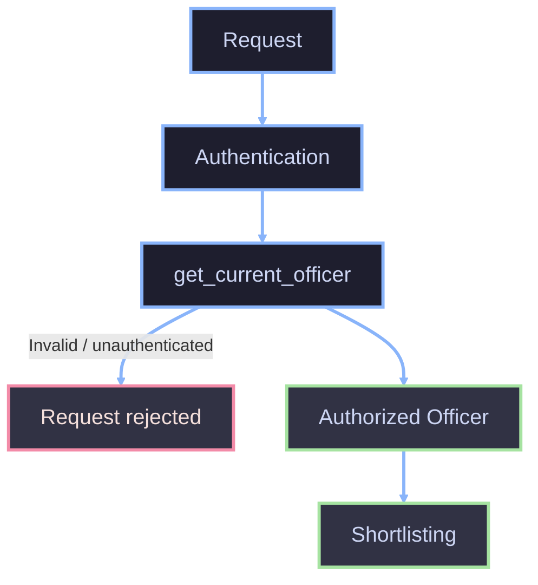

The `current_officer` is not directly used by the router after authentication. Its purpose is to enforce the authorization requirement before the shortlisting operation is executed.

<br>

## 4. Database Dependency

The endpoint receives an asynchronous SQLAlchemy database session through:

```python
db: AsyncSession = Depends(get_db)
```

This provides the database context required by the application's service layer and its underlying repositories.

The router itself does not perform database operations. Database access and business operations are delegated to the shortlisting service.

---

## 5. Service Layer

The shortlisting service is injected using the application factory:

```python
shortlisting_service: ShortlistingService = Depends(
    get_shortlisting_service
)
```

The router then invokes:

```python
result = await shortlisting_service.run_shortlisting_round(
    round_number
)
```


The router is therefore responsible only for **request handling, authentication, dependency injection, and error translation**. The actual shortlisting rules remain inside `ShortlistingService`.

<br>

## 6. Gale-Shapley Algorithm (Deferred Acceptance Algorithm)

### 6.1 complete flow
The complete shortlisting flow begins when an **Admission Officer/Admin** starts a shortlisting round.

The request first enters the **Shortlisting Service**, which performs the necessary preparation before invoking the matching algorithm.

The service performs the following operations sequentially:

1. **Validate the round number** to ensure that the requested round is supported.
2. **Expire stale offers** when processing rounds after Round 1.
3. **Compute remaining seats** for each branch based on previously accepted offers.
4. **Build the candidate pool** from applications that are eligible for the current round.
5. **Load branch information**, including branch capacity and cutoff marks.
6. **Run Deferred Acceptance** to determine the branch assignments.
7. **Create offers** for candidates who receive a seat.
8. **Create application status history** recording the `OFFER_MADE` transition.
9. **Send offer emails** to shortlisted students.
10. **Commit the transaction** so that the resulting assignments and application state are persisted.


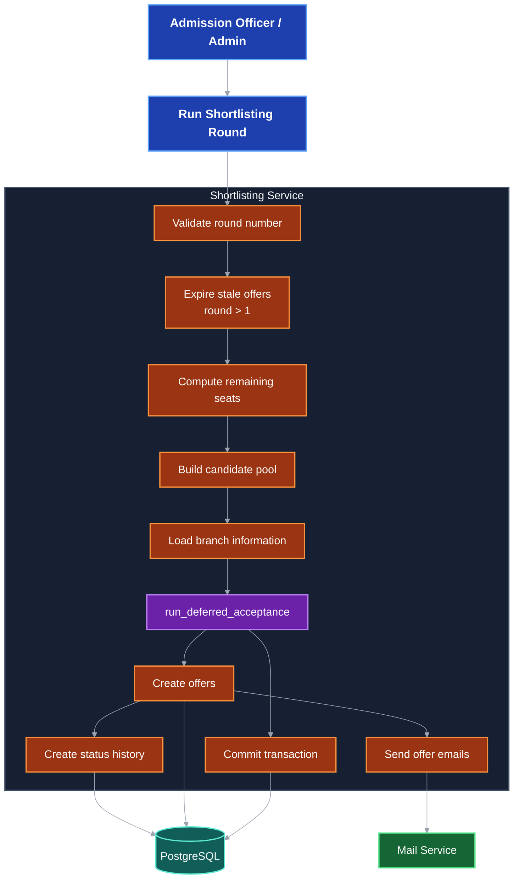


PostgreSQL stores the application, offer, and status-history information, while the mail service handles notification delivery.

The matching algorithm itself is deliberately separated from offer creation and persistence. Its responsibility is to determine **which application receives which branch**, while the surrounding service is responsible for converting those assignments into domain-level offers.


### 6.2 shortlisting round lifecycle

Each shortlisting operation represents one counselling round, with the system supporting Rounds 1 through 3.

The round starts by validating the requested round number. If the round is outside the supported range, the service raises an error and the shortlisting process does not continue.

For rounds greater than Round 1, stale offers from the previous round are processed before calculating the available seats. This ensures that students who did not respond within the permitted offer period are handled according to the offer policy.

After stale offers have been processed, the service calculates the seats remaining in each branch and builds the candidate pool. Branch information is then loaded and passed to the Deferred Acceptance algorithm.

If the algorithm produces no assignments, the transaction can still be committed and the round completes without creating new offers.

When assignments are produced, an offer is created for every assigned application. The application receives an OFFER_MADE status-history entry, while the corresponding offer is created with:

OfferStatus.PENDING
sent_at = now
expires_at = now + 72 hours

The offer email is then sent to the student. Once the database changes and associated operations have completed, the transaction is committed.

This separation ensures that the matching process determines the assignments first and that offer creation occurs only after the matching result is available.


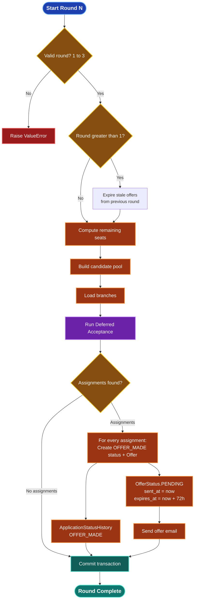

### 6.3 Candidate Pool Construction

The candidate pool contains the applications that are eligible to participate in the current shortlisting round.

Applications are retrieved from PostgreSQL and filtered according to their current application status.

The statuses that can enter the candidate-pool construction process are:

- `VALIDATED`

- `OFFER_REJECTED`

- `OFFER_EXPIRED`

Other application statuses are ignored because those applications are not eligible to participate in the current matching operation.

For every eligible application, the system loads the student's ordered branch preferences. The preference order represents the student's desired branches, with the first preference being the most preferred option.

An application is skipped if it has no branch preferences.

The student's academic information is then loaded. A candidate must have the required student and marks information available to participate in ranking. Candidates with missing required information are skipped.

For each valid application, the service creates a `Candidate` object containing information such as:

Application ID
Student ID
Ordered branch preferences
Merit-ranking key
Current preference index
Currently held branch

Initially, every candidate starts with next_pref_index = 0 and no held branch.

The resulting collection becomes the input to the Deferred Acceptance algorithm.

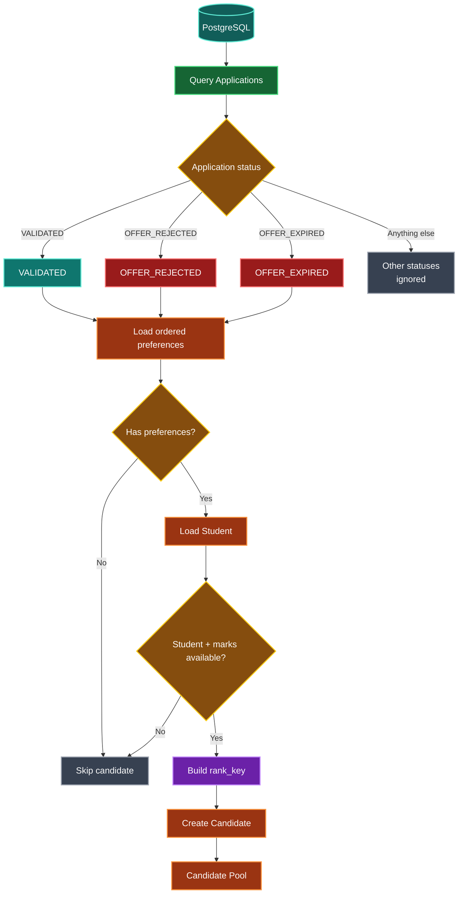

### 6.4 Ranking/tie-breaking logic

Branch capacity must be allocated according to academic merit. The implementation therefore creates a deterministic rank_key for every candidate.

The ranking order is:

- Total Marks
- Mathematics
- Physics
- Chemistry
- English

Higher marks are considered better for every criterion.

Because Python sorts tuples in ascending order, the implementation negates every mark:

```python
rank_key = (-total, -maths, -physics, -chemistry, -english)
```

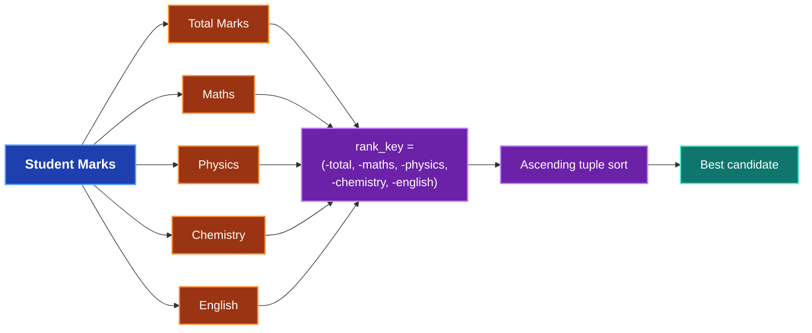

For example, suppose two candidates have the same total marks:

| Candidate A | Candidate B |
|---|---|
| **Total:** 90 | **Total:** 90 |
| **Maths:** 85 | **Maths:** 82 |
| **Physics:** 80 | **Physics:** 90 |
| **Chemistry:** 78 | **Chemistry:** 85 |
| **English:** 82 | **English:** 88 |

Their ranking keys begin with the same total-mark component. The next comparison is therefore Mathematics, where Candidate A has the higher score. Candidate A is consequently ranked ahead of Candidate B.

The tuple comparison continues from left to right until a difference is found.

This provides a deterministic tie-breaking hierarchy without requiring separate comparison logic for every pair of candidates.

The candidate with the lexicographically smallest `rank_key` is therefore the highest-ranked candidate.


### 6.5 Remaining Seat Calculation

For each branch, the number of available seats is calculated from the branch's total capacity and the number of seats already occupied by accepted offers.

The calculation is:

    remaining seats = total seats - accepted seats

Only offers in the `ACCEPTED` state are counted when determining occupied seats.

Accepted offers are grouped by `branch_id`, allowing the service to determine how many seats have already been consumed in each branch.

The resulting value is bounded at zero:

    seats_remaining = max(total_seats - accepted_count, 0)

This prevents the system from producing a negative seat count if the stored data temporarily indicates more accepted offers than the configured branch capacity.

The resulting remaining capacity is then supplied to the matching algorithm as the effective capacity of each branch for the current round.

This is particularly important for later rounds: previously accepted seats remain occupied, so Round 2 and Round 3 operate only on the seats that are still available.

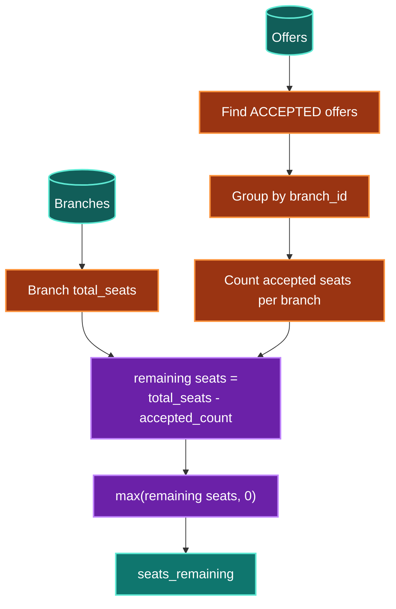

## 7 Working of Deferred Acceptance Algorithm

The core matching operation is implemented by `run_deferred_acceptance`.

At the beginning of the algorithm, every branch receives an empty list of currently held candidates, and every candidate is placed into the free-candidate pool.

The algorithm then proceeds iteratively.

### 7.1 Candidate proposes

A free candidate examines their preferences from the current `next_pref_index`.

The candidate advances the preference index before attempting the proposal. This guarantees that the same branch will not be proposed to repeatedly by the same candidate.

For each preference:

- If the branch ID does not exist, it is skipped.
- If the candidate's total marks do not meet the branch cutoff, the branch is skipped.
- Otherwise, the candidate proposes to that branch.

A candidate can therefore skip multiple branches before finding one to which they are eligible.

### 7.2 Branch collects proposals

Proposals are collected by branch.

The branch considers both:

- candidates it was already holding, and
- candidates who have proposed during the current iteration.

These candidates form a single pool.

### 7.3 Branch ranks candidates

The combined pool is sorted using the candidate's `rank_key`.

The best candidates appear first because the ranking key uses descending academic priority represented through negated values.

### 7.4 Branch keeps candidates up to capacity

The branch keeps only the first `capacity` candidates.

These candidates remain held by the branch.

Any candidates beyond the capacity are rejected from that branch and become free again.

### 7.5 Bumped candidates continue proposing

A candidate who is bumped does not leave the shortlisting process immediately.

Instead, the candidate is returned to the free-candidate pool with their `next_pref_index` already advanced.

On the next iteration, that candidate attempts their next preference.

This is the key property that distinguishes Deferred Acceptance from a simple greedy allocation.

### 7.6 Algorithm terminates

The process continues until no free candidate has another valid proposal to make.

At that point, no further assignment can be improved through another proposal, and the currently held candidates form the final matching.

The algorithm returns:

    {
        application_id: branch_id
    }

Only candidates who are ultimately holding a branch seat appear in the result.

Candidates who fail every cutoff, exhaust all preferences, or are unable to obtain a seat are absent from the result and therefore do not receive an offer in that round.

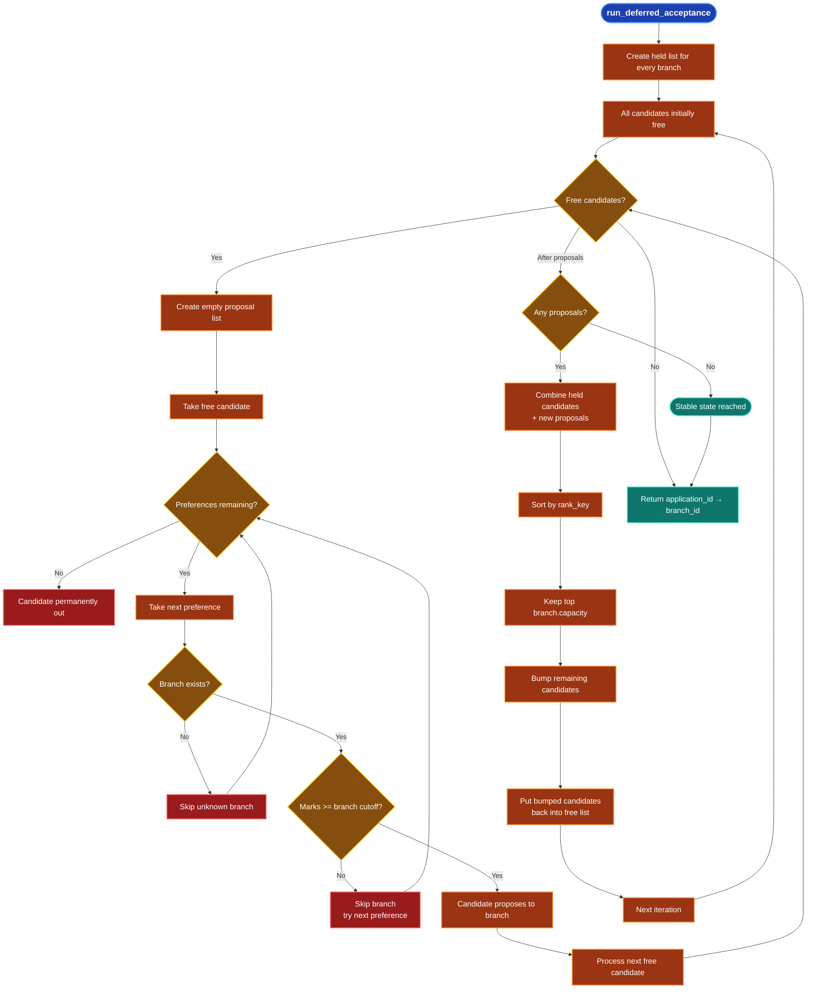

###  7.7 What happens at each branch?

Each branch independently maintains a set of candidates it is currently holding, subject to its capacity.

For example, consider a branch with capacity `2`.

Suppose it currently holds:

    Alice  - 95
    Bob    - 91

Two new candidates then propose:

    Carol  - 98
    David  - 88

The branch combines its existing candidates with the new proposals:

    Carol  98
    Alice  95
    Bob    91
    David  88

After sorting by merit, the branch keeps the top two candidates:

    Carol  98
    Alice  95

Bob and David are therefore bumped.

Importantly, being bumped does **not** mean that they are permanently rejected from the entire counselling process. They become free candidates and continue with their next preferences.

This allows a candidate who loses a seat at one branch to compete for another branch according to their preference order.

The branch therefore behaves as a temporary holder of its best available candidates rather than permanently assigning seats as soon as a proposal arrives.

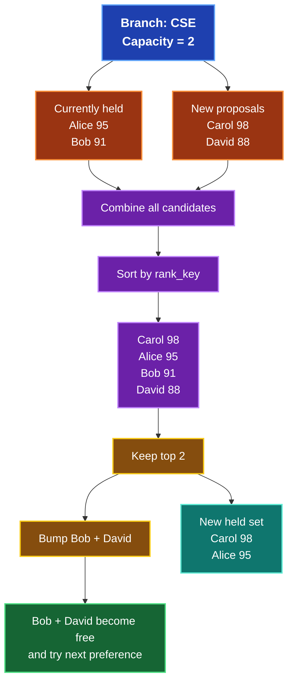

### 7.8 Candidate Proposal lifecycle

A candidate begins the matching process in the **Free** state.

When a preference is available, the candidate enters the **Proposing** state and attempts to obtain a seat at that branch.

If the candidate satisfies the branch cutoff and survives the branch's capacity-based ranking, the branch holds the candidate.

A held candidate can remain assigned to that branch while the algorithm continues.

However, if a stronger candidate subsequently proposes and causes the branch to exceed its capacity, the weaker candidate is bumped and returns to the **Free** state.

The candidate then tries their next preference.

This cycle can therefore occur multiple times:

    Free
      ↓
    Proposing
      ↓
    Held
      ↓
    Free
      ↓
    Proposing
      ↓
    Held

A candidate eventually reaches one of two terminal outcomes:

- **Held until the algorithm terminates** → receives the corresponding branch assignment.
- **Exhausts all preferences** → receives no assignment in that round.

This mechanism allows candidates to move progressively down their preference list without giving up better opportunities prematurely.

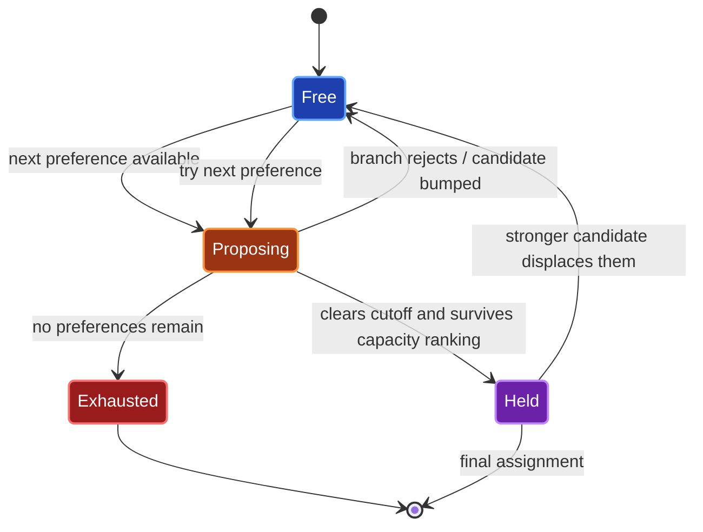

## 8. Multi-Round Shortlisting

The counselling process can execute up to **three shortlisting rounds**.

### Round 1

Round 1 starts with the original branch capacities and the eligible `VALIDATED` applications.

Deferred Acceptance determines the initial assignments and produces pending offers.

Students can then:

- accept the offer,
- reject the offer, or
- fail to respond before the offer expires.

Accepted offers consume seats for subsequent rounds.

### Subsequent Rounds

Before Round 2 or Round 3 begins, the system processes stale offers from the previous round and recalculates the remaining branch capacity.

Applications that remain eligible can participate again.

The matching algorithm is then executed against the **remaining seats**, rather than resetting branch capacities to their original values.

Consequently, a seat already consumed by an accepted offer is not reconsidered in a later round.

Applications carrying an `OFFER_REJECTED` or eligible `OFFER_EXPIRED` state can therefore enter the next matching round.

This creates an incremental counselling process where each round operates on the state left by the previous round.


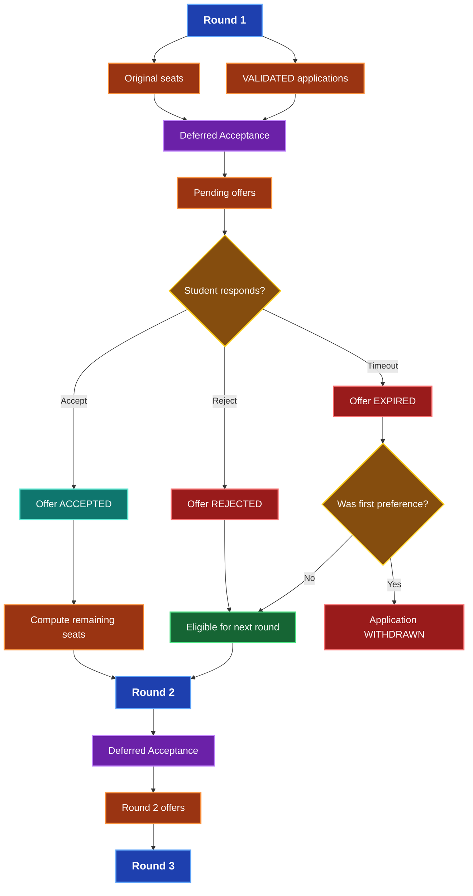

## 9. Expire Stale Offers


When a new round begins, pending offers from a previous round that have exceeded their response period must be resolved.

The system first changes the stale offer to `EXPIRED`.

It then determines whether the branch offered to the student was their **first preference**.

The result differs depending on that preference:

### 9.1 First-preference offer

If the expired offer corresponds to the student's first preference, the application is withdrawn.

The reasoning is that the student has allowed their highest-preference offer to expire and therefore leaves the counselling process.

The corresponding application status history is recorded.

### 9.2 Non-first-preference offer

If the expired offer was not the student's first preference, the application is marked as `OFFER_EXPIRED` and remains eligible for a subsequent round.

The student can therefore participate in the next shortlisting round and potentially receive an offer for another preferred branch.

This distinction prevents students from indefinitely remaining in the counselling process after allowing their highest-preference opportunity to expire while still allowing students with lower-preference offers to continue through later rounds.


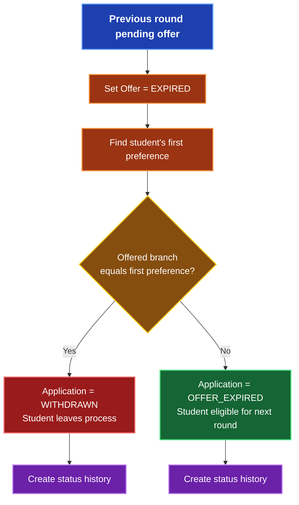

## 10. Complete Domain State Machine


The application progresses through a defined set of domain states during the counselling lifecycle.

A validated application begins in:

    VALIDATED

When selected by the shortlisting algorithm, it transitions to:

    OFFER_MADE

From `OFFER_MADE`, the student can produce one of several outcomes:

- **Accept** → `ACCEPTED`
- **Reject** → `OFFER_REJECTED`
- **Timeout on a non-first preference** → `OFFER_EXPIRED`
- **Timeout on the first preference** → `WITHDRAWN`

Applications in `OFFER_REJECTED` or eligible `OFFER_EXPIRED` states can participate in a subsequent shortlisting round and transition back to:

    OFFER_MADE

An accepted application reaches a terminal successful state:

    ACCEPTED

A withdrawn application reaches a terminal state:

    WITHDRAWN

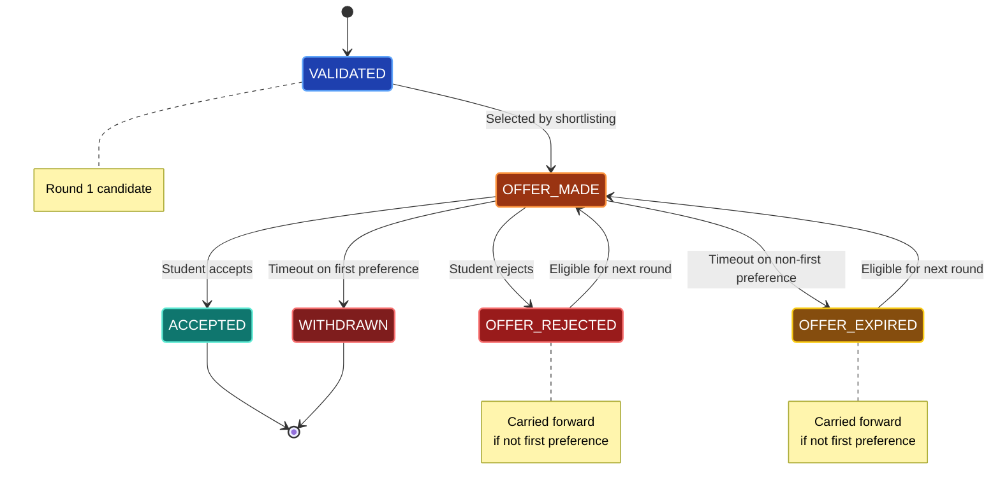


## 11. Error Handling

The shortlisting service may raise a `ValueError` when the requested operation violates a business rule or cannot be executed.

The router converts this exception into an HTTP `400 Bad Request` response:

```python
except ValueError as exc:
    raise HTTPException(
        status_code=400,
        detail=str(exc)
    )
```

Therefore:


The original exception message is returned as the response detail, allowing the client to understand why the shortlisting request was rejected.

---

## 12. Successful Execution

If the shortlisting service completes successfully, its result is returned directly by the router:

```python
return result
```

The router does not modify the service response.

The successful flow is therefore:

```mermaid
flowchart LR
    A[ Officer ] -->|POST /admin/rounds/round_number/shortlist| B[ Admin Router ]
    B -->|authenticate officer| C[ ShortlistingService ]
    C -->|run_shortlisting_round round_number| D[ Shortlisting Result ]
    D --> E[ HTTP Response ]

    classDef default fill:#1e1e2e,stroke:#89b4fa,stroke-width:3px,color:#cdd6f4,font-size:18px
    classDef officer fill:#313244,stroke:#f38ba8,stroke-width:3px,color:#f5e0dc
    classDef router fill:#313244,stroke:#89dceb,stroke-width:3px,color:#cdd6f4
    classDef service fill:#313244,stroke:#a6e3a1,stroke-width:3px,color:#cdd6f4
    classDef result fill:#313244,stroke:#fab387,stroke-width:3px,color:#cdd6f4
    classDef response fill:#313244,stroke:#cba6f7,stroke-width:3px,color:#cdd6f4

    class A officer
    class B router
    class C service
    class D result
    class E response

    linkStyle default stroke:#89b4fa,stroke-width:3px

```

---

## 13. Separation of Responsibilities

The shortlisting implementation follows a clear separation of concerns.

| Component                  | Responsibility                                     |
| -------------------------- | -------------------------------------------------- |
| `Admin Router`             | Exposes the shortlisting API endpoint              |
| `get_current_officer`      | Authenticates and identifies the admission officer |
| `get_db`                   | Provides the asynchronous database session         |
| `get_shortlisting_service` | Creates/provides the shortlisting service          |
| `ShortlistingService`      | Executes the actual shortlisting business logic    |
| Database / Repositories    | Provide persistent admission and student data      |

This prevents business rules from being embedded inside the API layer and makes the shortlisting algorithm easier to test and maintain.

<br>


## 14. Design Summary

The shortlisting endpoint acts as a **controlled administrative trigger** for the counselling process.

Its primary responsibilities are intentionally limited to:

1. Accepting the counselling round number.
2. Ensuring that the requester is an authenticated admission officer.
3. Obtaining the required application dependencies.
4. Delegating the operation to `ShortlistingService`.
5. Translating business validation errors into HTTP `400` responses.
6. Returning the shortlisting result to the client.

The actual admission allocation and shortlisting rules are encapsulated in the service layer, keeping the API layer lightweight and maintaining a clean separation between **HTTP concerns and admission business logic**.
